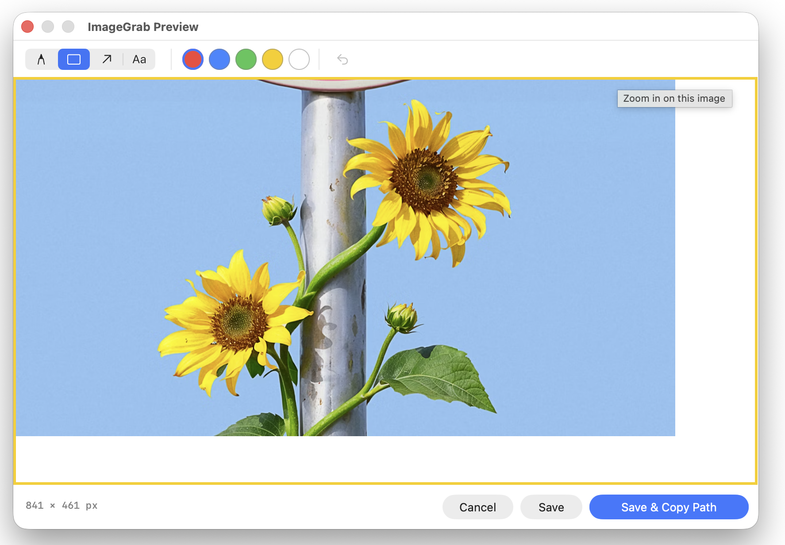
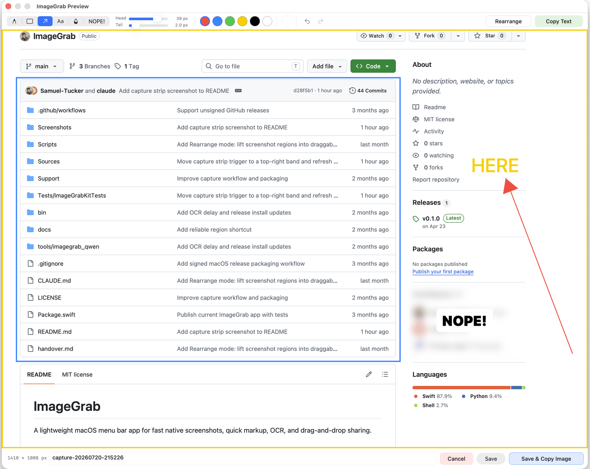
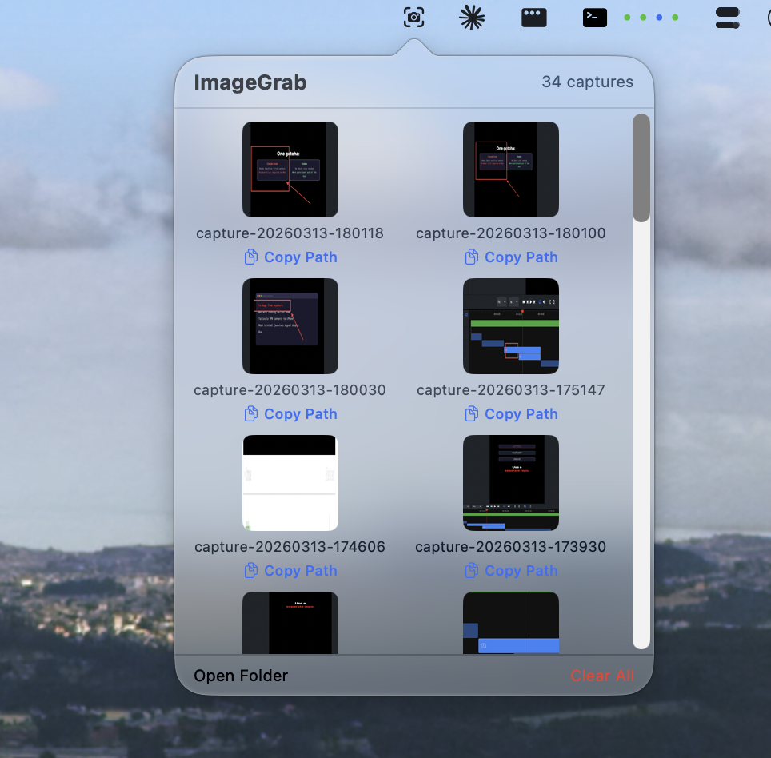

# ImageGrab

A lightweight macOS menu bar app for fast native screenshots, quick markup, and drag-and-drop sharing.

## Screenshots

| Preview Window | Annotation Tools |
|:-:|:-:|
|  |  |

| Thumbnail Grid | Context Menu |
|:-:|:-:|
|  |  |

## Features

- **Global hotkey** — Press `Ctrl+Opt+G` from anywhere to trigger the native macOS screenshot crosshair
- **Preview before saving** — Review every capture before it is written to disk
- **Annotation tools** — Pen, box, arrow, and text with color presets plus a text background picker
- **Movable annotations** — Click existing text, boxes, arrows, or pen strokes to reposition them
- **Editable text markup** — Click text annotations to reopen editing, then adjust font size with `Cmd+=`, `Cmd+-`, or the scroll wheel
- **Quick view panel** — Hover a thumbnail and click the eye icon for a floating larger preview
- **Thumbnail grid** — Browse up to 50 recent captures from the menu bar popover
- **Drag and drop** — Drag captures into Slack, browsers, Finder, terminals, and Electron apps
- **Inline rename** — Click a filename or use the context menu to rename captures in place
- **Context menu** — Copy path, reveal in Finder, rename, or delete any capture
- **Efficient output** — Saves WebP when available on the host macOS version and falls back to PNG otherwise

## Requirements

- macOS 13+
- Accessibility permission for the global hotkey and native screenshot trigger

ImageGrab uses the built-in macOS screenshot tool, so it does not require a separate Screen Recording permission prompt in the app itself.

## Install

For end users, the intended install path is a signed and notarized app download from GitHub Releases:

- `.zip` for direct app extraction
- `.dmg` for drag-to-Applications install

Release artifacts are published at:

`https://github.com/Samuel-Tucker/ImageGrab/releases`

## Build

```sh
git clone https://github.com/Samuel-Tucker/ImageGrab.git
cd ImageGrab
./Scripts/build_app.sh
```

The build script creates `~/Applications/ImageGrab.app`, registers it with Launch Services, and attempts to codesign it with the local `ImageGrab Dev` identity if that certificate exists.

## Usage

1. Press `Ctrl+Opt+G` or click the menu bar icon.
2. Select a screen region with the native macOS crosshair.
3. Annotate in the preview window if needed.
4. Click `Save` or `Save & Copy Path`.
5. Use the menu bar popover to copy paths, rename files, quick-view images, or drag captures into other apps.

Captures are stored in `~/repos/ImageGrab/captures/`.

## Keyboard Shortcuts

| Shortcut | Action |
|----------|--------|
| `Ctrl+Opt+G` | Start capture |
| `Cmd+Z` | Undo the last committed annotation |
| `Esc` | Cancel capture, clear selection, or finish text editing |
| `Return` | Save & Copy Path from the preview window |
| `Cmd+=` / `Cmd+-` | Increase or decrease selected text size |
| `Scroll wheel` | Adjust text size while using or editing the text tool |

## Tech Stack

Swift 6 · SwiftUI · AppKit · Swift Package Manager · Carbon hotkey API

## Releasing

Maintainers can build signed and notarized release artifacts with:

```sh
./Scripts/build_release_assets.sh v0.1.0
```

The GitHub Actions release workflow publishes `.zip`, `.dmg`, and checksum assets from version tags. Full setup details are in [docs/releasing.md](docs/releasing.md).

## License

MIT
